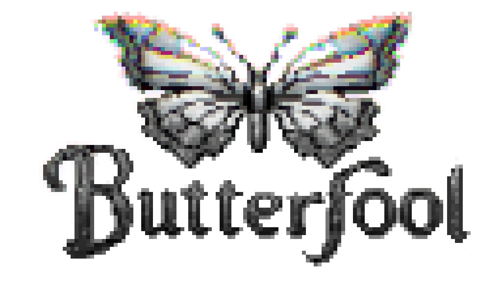

&nbsp;&nbsp;&nbsp;&nbsp;&nbsp;&nbsp;&nbsp;&nbsp;&nbsp;&nbsp;&nbsp;&nbsp;&nbsp;&nbsp;&nbsp;&nbsp;&nbsp;&nbsp;&nbsp;&nbsp;
&nbsp;&nbsp;&nbsp;&nbsp;&nbsp;&nbsp;&nbsp;&nbsp;&nbsp;&nbsp;&nbsp;&nbsp;&nbsp;&nbsp;&nbsp;&nbsp;&nbsp;&nbsp;&nbsp;&nbsp;
&nbsp;&nbsp;&nbsp;&nbsp;&nbsp;&nbsp;&nbsp;&nbsp;&nbsp;&nbsp;&nbsp;
[![Language][scala-shield]][scala-url]
[![MIT License][license-shield]][license-url]
[![Contributors][contributors-shield]][contributors-url]
[![Issues][issues-shield]][issues-url]

## Overview:

**Butterfool** is a _Functional_, _Object-Oriented_, _JVM-based_ programming language. It's still alpha, so don't judge.

<!--
***
    GITHUB SHIELDS VARIABLES
***
-->

[scala-shield]: https://img.shields.io/badge/scala-%23DC322F.svg?style=flat&logo=scala&logoColor=white

[scala-url]: https://www.scala-lang.org/

[stars-shield]: https://img.shields.io/github/stars/FreshMag/butterfool.svg?style=flat

[stars-url]: https://github.com/FreshMag/butterfool/stargazers

[issues-shield]: https://img.shields.io/github/issues/FreshMag/butterfool.svg?style=flat

[issues-url]: https://github.com/FreshMag/butterfool/issues

[license-shield]: https://img.shields.io/github/license/FreshMag/butterfool.svg?style=flat

[license-url]: https://github.com/FreshMag/butterfool/blob/master/LICENSE

[contributors-shield]: https://img.shields.io/github/contributors/FreshMag/butterfool.svg?style=flat

[contributors-url]: https://github.com/FreshMag/butterfool/graphs/contributors
